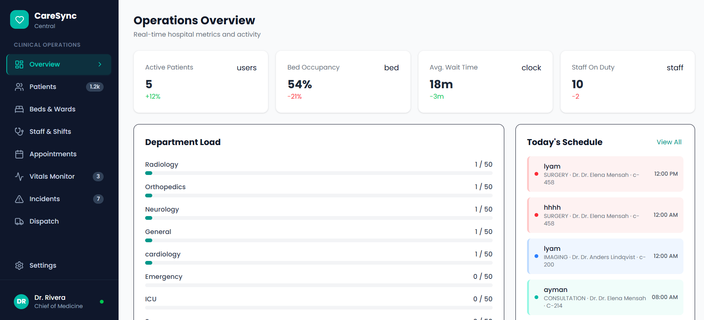
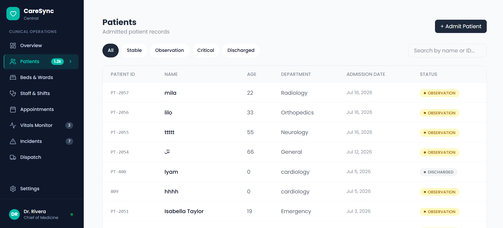
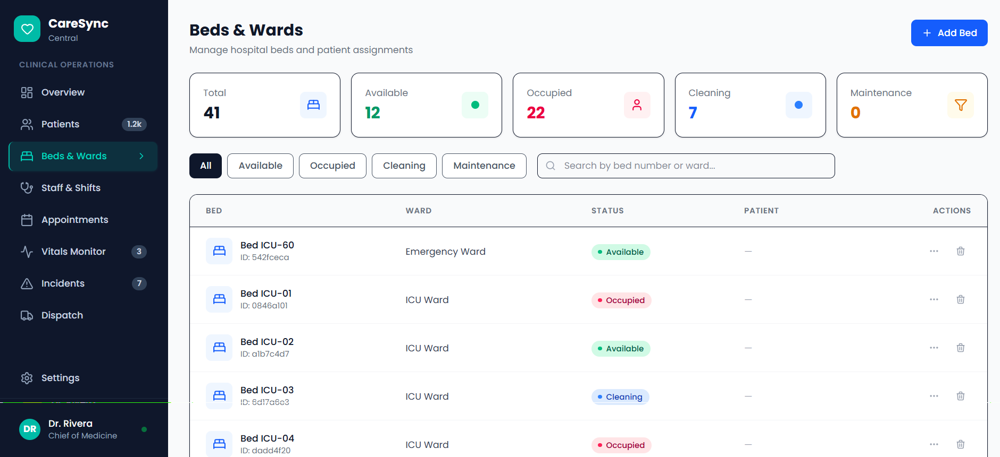

# HospiLink

**Web platform designed to streamline hospital management and patient care coordination.**

---

## Overview

HospiLink is a comprehensive hospital management system built to simplify healthcare operations and enhance the patient experience. The platform features a robust RESTful API backend powered by **Node.js** and **Express.js**, paired with a dynamic, responsive frontend using **React.js**.

---

##  Key Features

| Feature | Description |
|---------|-------------|
|  **Real-time Patient Flow Tracking** | Monitor bed occupancy, patient admissions, and ward capacity in real time |
|  **Doctor-Specific Appointment Management** | Book, cancel, and reschedule appointments with intelligent scheduling |
|  **Electronic Health Records (EHR)** | Centralized patient records with secure access and history tracking |
|  **Role-Based Access Control** | Granular permissions for doctors, nurses, admins, and reception staff |
|  **Bilingual UI** | Fully responsive interface supporting Arabic and English |
|  **Real-Time Notifications** | Live updates via Socket.io for critical alerts and status changes |
|  **Analytics Dashboard** | Visual insights into hospital operations and resource utilization |

---

## Live Demo

 **Live Link:** [hospi-link-liart.vercel.app](https://hospi-link-liart.vercel.app/)

---

## Tech Stack

### Backend
| Technology | Purpose |
|------------|---------|
| **Node.js** | Runtime environment |
| **Express.js** | Web framework & RESTful API |
| **TypeScript** | Type-safe development |
| **Prisma** | ORM for database operations |
| **PostgreSQL** | Primary database (hosted on Neon) |
| **Socket.io** | Real-time bidirectional communication |
| **Docker** | Containerization |

### Frontend
| Technology | Purpose |
|------------|---------|
| **React.js** | UI library |
| **TypeScript** | Type-safe development |
| **Tailwind CSS** | Utility-first styling |
| **React Query** | Server state management & caching |
| **Sonner** | Toast notifications |
| **Lucide React** | Icon library |
| **i18n** | Internationalization (Arabic / English) |

### DevOps & Tools
| Technology | Purpose |
|------------|---------|
| **CI/CD Pipeline** | Automated testing & deployment |
| **Web Vitals** | Performance monitoring |
| **PWA** | Progressive Web App capabilities |

---

## Deliverables

- Automated patient queue management
- Real-time appointment and bed availability tracking
- Centralized electronic health records (EHR) system
- Optimized medical resource allocation and staff scheduling
- Bilingual patient portal for seamless communication
- Data-driven logistics reporting

---

## Project Structure

```
HospiLink/
├── backend/
│   ├── src/
│   │   ├── config/          # Database & environment config
│   │   ├── controllers/     # Route handlers (beds, patients, appointments...)
│   │   ├── routes/          # Express route definitions
│   │   ├── middleware/      # Auth, validation, error handling
│   │   └── types/           # TypeScript interfaces
│   ├── prisma/
│   │   └── schema.prisma    # Database schema
│   └── Dockerfile
├── frontend/
│   ├── src/
│   │   ├── components/      # Reusable UI components
│   │   ├── pages/           # Route-level pages
│   │   ├── services/        # API client & data fetching
│   │   ├── hooks/           # Custom React hooks
│   │   └── types/           # TypeScript types
│   └── public/
└── docker-compose.yml
```

---

## Getting Started

### Prerequisites
- Node.js ≥ 18
- PostgreSQL (or Neon account)
- Docker (optional)

### Backend Setup
```bash
cd backend
npm install
# Create .env file (see .env.example)
npx prisma migrate dev
npm run dev
```

### Frontend Setup
```bash
cd frontend
npm install
npm run dev
```

### Docker (Full Stack)
```bash
docker-compose up --build
```

---

## API Endpoints

| Method | Endpoint | Description |
|--------|----------|-------------|
| GET | `/api/beds` | List all beds |
| GET | `/api/beds/:id` | Get bed by ID |
| POST | `/api/beds` | Create new bed |
| PUT | `/api/beds/:id` | Update bed |
| DELETE | `/api/beds/:id` | Delete bed |
| GET | `/api/patients` | List patients |
| GET | `/api/wards` | List wards |

---

## Screenshots




---

## Contributing

Contributions are welcome! Please open an issue or submit a pull request.

---

## License

This project is licensed under the MIT License.

---

## Links

- **Live:** [hospi-link-liart.vercel.app](https://hospi-link-liart.vercel.app/)
- **GitHub:** [github.com/Ayaalmadhon2004/HospiLink](https://github.com/Ayaalmadhon2004/HospiLink)

---

<p align="center">
  <strong>Built with ❤️ for better healthcare</strong>
</p>
